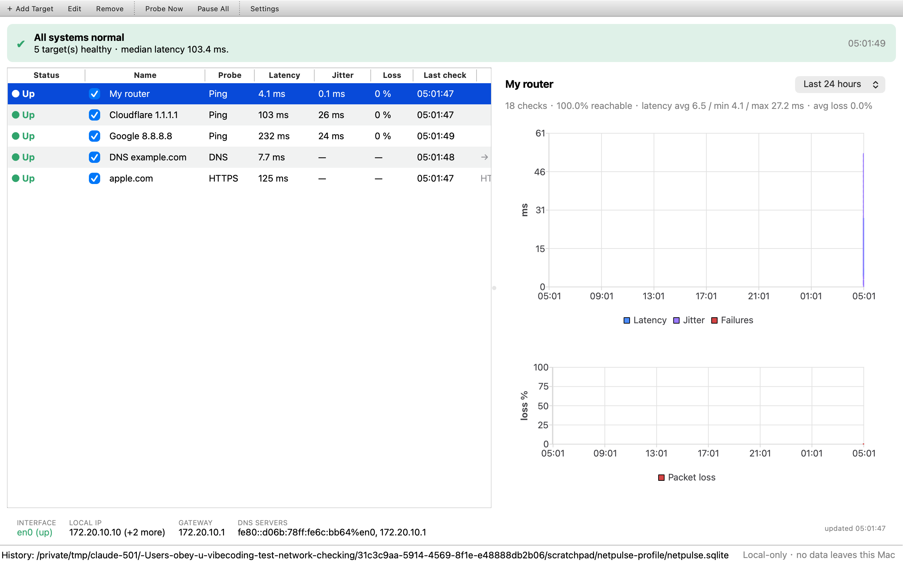

# NetPulse — Local Network Health Monitor

[](https://github.com/obeyer1/NetPulse/actions/workflows/ci.yml)
[](LICENSE)

NetPulse is a small, open-source macOS app for **daily network health
observation**. It continuously checks targets *you* choose — your router, a
public DNS resolver, a website — and tells you in plain language what is
wrong when something breaks: *"DNS error"*, *"External network unreachable —
local router is fine"*, and so on.



## What it monitors

| Probe | What it measures |
|---|---|
| **Ping** (ICMP echo) | reachability, latency, jitter, packet loss |
| **DNS lookup** | resolution success and lookup time, against the system resolver or any server you pick |
| **HTTPS request** | connectivity, HTTP status, time-to-first-byte and total response time |

On top of the per-target results NetPulse shows:

- an overall **diagnosis banner** that combines all targets plus your local
  network state into one conclusion (all normal / DNS error / local network
  down / ISP outage / packet loss / high jitter …)
- **live charts** of latency, jitter and packet loss for the last 1 / 6 / 24
  hours, backed by the local history database
- **local network info**: active interface, local IP, default gateway and
  configured DNS servers (read-only)

## What it will never do

NetPulse is a health monitor, **not** a scanning or auditing tool. By design:

- **Target-only probing.** It only ever contacts targets you added yourself.
  No port scans, no LAN discovery, no packet sniffing, no vulnerability
  checks.
- **Read-only system state.** It reads your interface/gateway/DNS
  configuration; it never changes anything.
- **Privacy first.** No telemetry, no uploads, no sync. History lives in a
  single local SQLite file you can inspect or delete at any time.
- **Rate-limited.** Default check interval is 30 s; the enforced minimum is
  5 s (clamped in the UI, the scheduler and the storage layer).
- **Unprivileged.** Pings use macOS ICMP datagram sockets — no root, no
  setuid helpers, no raw sockets.

## Building

Requirements: macOS 13+, Xcode command line tools, [Homebrew](https://brew.sh).

```bash
brew install cmake ninja qt
git clone https://github.com/obeyer1/NetPulse.git
cd NetPulse
cmake -S . -B build -G Ninja -DCMAKE_BUILD_TYPE=Release -DCMAKE_PREFIX_PATH="$(brew --prefix qt)"
cmake --build build
open build/NetPulse.app
```

Run the tests with:

```bash
ctest --test-dir build --output-on-failure
```

## Using it

1. Start NetPulse. The welcome screen offers one-click starters (your
   detected gateway, `1.1.1.1`, a DNS lookup, an HTTPS check) — nothing is
   monitored until you click one or add your own target.
2. Add targets with **＋ Add Target**: a ping host, a DNS lookup (optionally
   against a specific server — handy for comparing your router's DNS with
   `1.1.1.1`), or an HTTPS URL.
3. Select a target to see its history charts; switch the window between the
   last hour, 6 hours and 24 hours.
4. Watch the banner. When something breaks, NetPulse cross-references your
   targets (router vs. external IPs vs. DNS vs. HTTPS) and states the most
   likely layer: local link, router, ISP/uplink, DNS or web/TLS.

A useful starter set: your router + one public IP (`1.1.1.1`) + one DNS
lookup + one HTTPS site. That combination lets the diagnosis engine tell
local, ISP, DNS and web problems apart.

### Data location

History and settings live in
`~/Library/Application Support/NetPulse/netpulse.sqlite` (WAL-mode SQLite,
pruned to a configurable retention window, 7 days by default). Delete the
file and NetPulse starts fresh.

## Architecture

```
src/
├── core/
│   ├── IcmpPinger.*        blocking ICMP echo batches (thread pool), RTT/jitter/loss
│   ├── Probes.*            async DNS + HTTPS probes with timeout & retry
│   ├── ProbeScheduler.*    worker-thread scheduler; interval clamp; overlap guard
│   ├── SystemInfo.*        read-only interface/gateway/DNS collector (own thread)
│   ├── Diagnostics.*       pure rule engine → human-readable conclusion (unit tested)
│   └── Types.h             shared value types
├── storage/Storage.*       SQLite worker thread; batched writes; retention pruning
└── ui/                     Qt Widgets main window, targets table, QtCharts panels
```

Threading model: the UI thread never does network or disk I/O. Probes run on
a dedicated scheduler thread (ping batches on a small thread pool), system
info collection on its own thread, and all SQLite access on a storage thread
with batched transactional writes. Every request has a timeout, a retry
limit, cancellation on shutdown, and a human-readable error message.

### Developer flags

```
NetPulse --data-dir <dir>          # use an alternate profile directory
NetPulse --screenshot <file>       # save a window screenshot and quit
NetPulse --screenshot-delay <sec>  # wait before the screenshot (default 30)
NetPulse --quit-after <sec>        # exit automatically (CI/smoke tests)
```

## License

[MIT](LICENSE)
